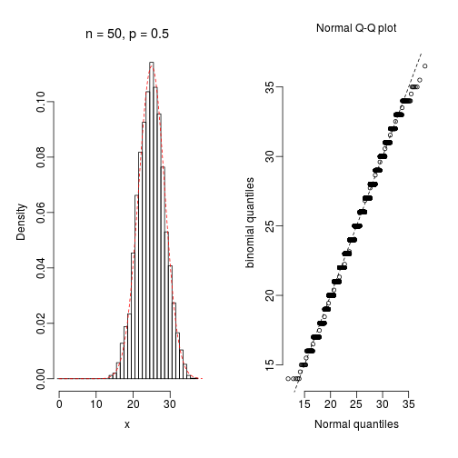
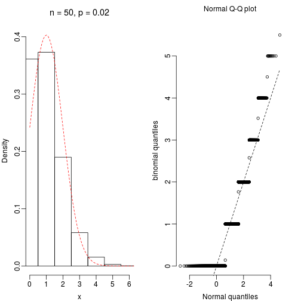

## The Aim

In an elementary introductory statistics class the students are told that if X is Binomially distributed, that is, $X \sim B(n,p)$ then the distribution of X can be approximated by the distribution of $Y$, where $Y \sim N(np, np(1-p))$, provided that $np>5$ and $n(1-p)>5$.

A proof of this fact is too complicated for an elementary class. Hence, we would like to at least illustrate this fact by using R.

---

## The procedure
We sample $100n$ times from the $B(n,p)$ binomial distribution. Then draw the histogram for the sampled observations and fit the probability density function for the normally distributed 
random variable $Y\sim N(np, np(1-p))$. The better the approximation the better the curve for the normal density function will follow the histogram.

It can be hard to judge whether the probability density function follows the histogram sufficiently well. Hence, we also draw a QQ-plot of the observed quantiles for the sample from the Binomial distribution versus the theoretical quantiles for the $N(np, np(1-p))$ distribution. The closer the Binomial distribution is to the normal distribution $N(np, np(1-p))$ the closer the points will be to the line $y=x$.

---

## Good approximation
 
 

---

## Bad approximation

 
